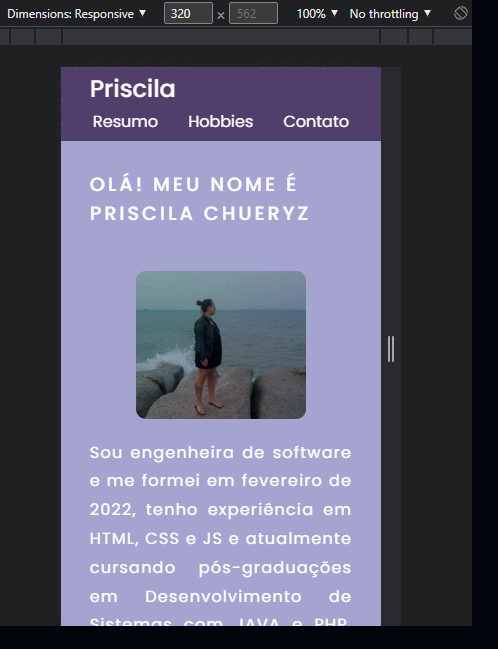

<h1 align="center">
    
</h1>

<h3 align="center">
    <a href="#">Acessar a demonstração</a>
<h3 >

# Indice

- [Sobre](#-sobre)
- [Tecnologias Utilizadas](#-tecnologias-utilizadas)
- [Como baixar o projeto](#-como-baixar-o-projeto)

## 🔖&nbsp; Sobre

O projeto **Apresentação Individual** é uma pequena apresentação  separado em 3 partes, Resumo, Hobbies e um formulário de contato (que por enquanto só irá simular) **Formação Web Dev Fullstack** com o intuito de colocarmos em prática todo conteúdo estudado na primeira parte do módulo 1 do curso.

Todo o código está comentado com as explicações do que foi feito no projeto e as escolhas que eu tomei como:
 - site responsivo e contém um arquivo css separado para as - [Medias Queries](https://developer.mozilla.org/pt-BR/docs/Web/CSS/Media_Queries/Using_media_queries).
 - o efeito de **Glassmorphism** (https://blog.logrocket.com/implement-glassmorphism-css/) que é é uma tendência de design de interface do usuário que imita a aparência do vidro fosco.

 Entre outros, **Vale a pena dar uma olhada 😁**

---

## 🚀 Tecnologias utilizadas

O projeto foi desenvolvido utilizando as seguintes tecnologias

- [HTML](https://developer.mozilla.org/pt-BR/docs/Web/HTML) ou (https://www.w3schools.com/html/)
- [CSS](https://developer.mozilla.org/en-US/docs/Web/CSS) ou (https://www.w3schools.com/css/)
---

## 🗂 Como baixar o projeto

```bash

    # Clonar o repositório
    $ git clone https://github.com/SuayMack/projeto1-apresentacaoIndividual.git

    # Entrar no diretório
    $ cd projeto1-apresentacaoIndividual

    # Comece a trabalhar no projeto   
    
```
---

Desenvolvido 💜 por Priscila Chueryz dos Santos